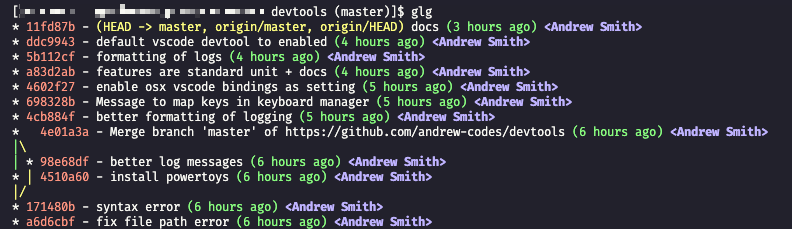
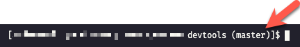

# Bash

- Ensure devtool environment variables are available in bash instances.
- Ensure `$TOOLS_BIN_HOME` is found in the environment path.

## 1Password CLI tool

Use 1Password CLI to access secrets for other devtool CLI tooling.
## Commands

### General

1. App using Port: `aup $PORT` will return the process listening on `$PORT`

### Docker

1. Docker kill all containers: `dka`
2. Docker environment; `denv $HOST` will set `DOCKER_HOST=$HOST`

## Devpod

Client application that creates codespaces on a variety of providers. Using for dev containers spun up on self-hosted Kubernetes cluster.

### Commands

**devbuild**: Build dev container image to be used with devpod as a prebuild image.

> Note, must be authenticated with ghcr.io for this to work. Ensure you set the GITHUB_TOKEN environment variable.

```bash
devbuild repo_name
```

**devup**: Bring up a dev environment on a K8s cluster.

```bash
devup repo_name
```
## Git Shell Auto-Completion

Enable tabbing in bash to auto-complete git commands.

## Extended Git

### Commands

> For more detailed usage of commands, see below this list.

- `pull` => `git pull`
- `fa` => `git fetch --all` (fetch history from all remotes)
- `st` => `git status`
- `rbi` => `git rebase -i`
- `rbc` => `git rebase --continue`
- `rbs` => `git rebase --skip`
- `rba` => `git rebase --abort`
- `co` => `git checkout`
- `glg` => print history in a meaningful way
- `rh` => reset hard (parameterized)
- `rs` => reset soft (parameterized)
- `lb` => list or search all branches (including remotes)
- `nb` => create a new branch, push, and set its upstream
- `pull` => pull via rebase; ensure rebase is used
- `sb` => set a branch to its upstream
- `gnxt` => checkout the next, future, commit from your current ref


**glg**: Prints git history in the terminal in a meaningful way.



**Reset Hard**: hard reset and a clean; removes all uncommitted changes and any untracked files. Can optionally provide a branch or origin and branch in which to reset your current working branch `HEAD`.

```bash
rh
rh branch_name
rh remote_name branch_name
```

**Reset Soft**: soft reset of uncommitted files, but omits untracked files. Can optionally provide a branch or origin and branch in which to reset your current working branch `HEAD`.

```bash
rs # effectively a `git checkout .`
rs branch_name
rs remote_name branch_name
```

**Search and List Branches**: search local and remote branches by name via a grep pattern.

```bash
lb # list all (remote and local)
lb search_term
```

**New Branch**: creates a new branch and will automatically push to remote (origin), then set local branch's upstream to the newly pushed remote branch. If a `base_branch` is provided, then it will automatically stash your changes and pull the latest of the `base_branch` before creating your new branch from it.

```bash
nb new_branch_name
nb base_branch new_branch_name
```

**Delete Branch**: deletes a branch locally and remotely.

```bash
db branch_name
```

**Pull**: pull via a rebase

```bash
pull
pull branch_name
pull remote branch_name
```

**Set Branch**: sets a local branch's upstream to a remote branch of the same name. If called with no parameters, will the current working branch name and the origin remote.

```bash
sb
sb branch_name
sb remote_name branch_name
```

**Go to next, future commit**: allows you to navigate one commit in the future from your current ref and a branch ref.

```bash
# main <- sha2 <- sha1 (HEAD)

gnxt main

# Will checkout sha2
```

## Git Prompt

See the current repository's status in your shell's prompt.



## Project Finder

Auto-complete search of your projects (repos). Each of the following commands will tab auto-complete.

> Repos searched are those found at `$REPO_HOME/*`.

1. `oproj some-repo` will open `some-repo` in Visual Studio Code
2. `proj` will change directory to your repo directory
3. `proj some-repo` will change directory to `some-repo` directory
4. `projs` will list all your repos
5. `projs some-value` will return any repo with `some-value` in the name

## 1Password SSH Agent

Enables 1Password to manage SSH key pass phrases. See [1password documentation](https://developer.1password.com/docs/ssh/agent) for more details.

> After running the dev tools installation, ensure you [enable 1Password's SSH Agent](https://developer.1password.com/docs/ssh/get-started#step-3-turn-on-the-1password-ssh-agent).

## SSH Agent

Enables entering your SSH pass phrase only once, at the start of a shell, instead of every time you use it; e.g., `git push`.

# Git

## Git Config

Automatically setup your `.gitconfig` file.

# Mouse Gestures

Enable navigation of OSX spaces via mouse gestures. See the [software's website](https://mousefix.org/about/) for more details on giving input permissions.


# VS Code

- Ensure VS Code is installed.

## Dracula Theme

### Activating theme

1. Go to `View -> Command Palette` or press `Ctrl+Shift+P`
2. Type `Preferences: Theme Color`
3. Choose `Dracula Pro`

## OSX Keybindings for Windows

When using Windows from a remote desktop client on OSX, this feature will ensure the same shortcuts apply in VS Code in OSX and Windows; e.g., `Cmd+S` will save on both Windows and OSX.

### Troubleshooting

1. Ensure Microsoft Windows PowerToys's Keyboard Manager is enabled.
2. Ensure Left-Windows key is mapped to Left-Ctrl in Keyboard Manager.

