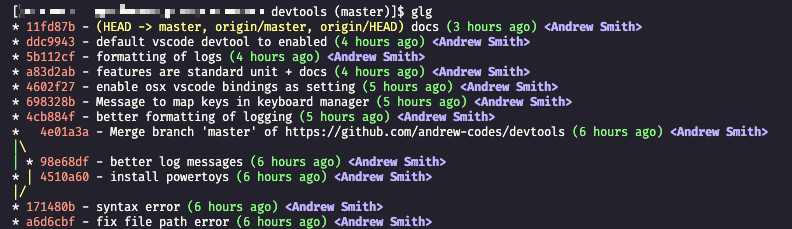

## Extended Git

### Commands

- `pull` => `git pull`
- `fa` => `git fetch --all` (fetch history from all remotes)
- `st` => `git status`
- `rbi` => `git rebase -i`
- `rbc` => `git rebase --continue`
- `rbs` => `git rebase --skip`
- `rba` => `git rebase --abort`
- `co` => `git checkout`
- `glg` => print history in a meaningful way
- `rh` => reset hard (parameterized)
- `rs` => reset soft (parameterized)
- `lb` => list or search all branches (including remotes)
- `nb` => create a new branch, push, and set its upstream
- `pull` => pull via rebase; ensure rebase is used
- `sb` => set a branch to its upstream
- `gnxt` => checkout the next, future, commit from your current ref


> Usage of commands see below:

**glg**: Prints git history in the terminal in a meaningful way.



**Reset Hard**: hard reset and a clean; removes all uncommitted changes and any untracked files. Can optionally provide a branch or origin and branch in which to reset your current working branch `HEAD`.

```bash
rh
rh branch_name
rh remote_name branch_name
```

**Reset Soft**: soft reset of uncommitted files, but omits untracked files. Can optionally provide a branch or origin and branch in which to reset your current working branch `HEAD`.

```bash
rs # effectively a `git checkout .`
rs branch_name
rs remote_name branch_name
```

**Search and List Branches**: search local and remote branches by name via a grep pattern.

```bash
lb # list all (remote and local)
lb search_term
```

**New Branch**: creates a new branch and will automatically push to remote (origin), then set local branch's upstream to the newly pushed remote branch. If a `base_branch` is provided, then it will automatically stash your changes and pull the latest of the `base_branch` before creating your new branch from it.

```bash
nb new_branch_name
nb base_branch new_branch_name
```

**Delete Branch**: deletes a branch locally and remotely.

```bash
db branch_name
```

**Pull**: pull via a rebase

```bash
pull
pull branch_name
pull remote branch_name
```

**Set Branch**: sets a local branch's upstream to a remote branch of the same name. If called with no parameters, will the current working branch name and the origin remote.

```bash
sb
sb branch_name
sb remote_name branch_name
```

**Go to next, future commit**: allows you to navigate one commit in the future from your current ref and a branch ref.

```bash
# main <- sha2 <- sha1 (HEAD)

gnxt main

# Will checkout sha2
```
